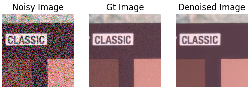
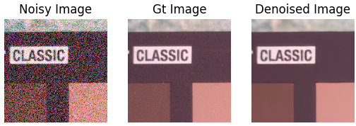
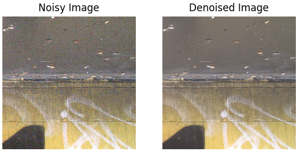
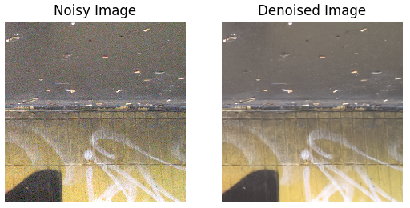
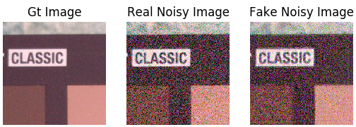

# DANet
# Dual Adversarial Network: Toward Real-world Noise Removal and Noise Generation (ECCV, 2020) [ECCV Version](DANet_paper_ECCV.pdf) [arXiv Version](DANet_paper_arXiv.pdf)

Due to the page limitation, the experimental results on Nam benchmark and some discussions were not included in the ECCV paper and put into
[supplementary material](DANet_supplementary.pdf).
And the arXiv version includes the complete experimental results.

# Requirements and Dependencies
* Ubuntu 16.04, cuda 10.0
* Python 3.7.4, Pytorch 1.3.1
* More detail (See [environment.yml](environment.yml))

# Training pipelines

The DANet model was trained on [SIDD Medium Dataset](https://www.eecs.yorku.ca/~kamel/sidd/dataset.php), and tested on SIDD
[validation and testing](https://www.eecs.yorku.ca/~kamel/sidd/benchmark.php) datasets. For DANet+, we employed the noise-free images
in the original training dataset (i.e., SIDD Medium Dataset) as source images to simulate more clean-noisy image pairs using the 
trained generator.  

Different from DANet, GDANet trained on the concatenation of SIDD Medium, [PolyU](https://github.com/csjunxu/PolyU-Real-World-Noisy-Images-Dataset)
and [Renoir](http://ani.stat.fsu.edu/~abarbu/Renoir.html) Datasets. For GDANet+, we adopted other high-quality images
in [Flickr](https://press.liacs.nl/mirflickr/) as source
images to simulate more training pairs. Of cource, you can use any other images instead of Flickr.

## Prepare data:
Writing the SIDD and Renoir datasets into hdf5 fromat:
```
    python datasets/preparedata/SIDD_big2small_train.py --data_dir yours_sidd_data_path
    python datasets/preparedata/SIDD_big2small_test.py --data_dir yours_sidd_data_path
    python datasets/preparedata/Renoir_big2small_all.py --data_dir yours_renoir_data_path
```
## Training settings:
Modify the training settings for specific model in [configs](configs) floder. Note that you at least need to revise the saving path of training and testing datasets accroding to your own computers.

## Begin training:
+ Train DANet
```
    python train_DANet.py 
```
+ Train DANet+
```
    python train_DANetPlus.py 
```
+ Train GDANet
```
    python train_GDANet.py 
```
+ Train GDANet+
```
    python train_GDANetPlus.py 
```

# Testing pipelines

## Testing denoising results
+ Test DANet
```
    python test_denoising_SIDD.py --model DANet
```


To re-produce the paper results on the SIDD validation data set, please refer to [test_denoising_SIDD_val.py](test_denoising_SIDD_val.py). 

To re-produce the paper results on the SIDD Benchmark of officail website, please refer to [DANetPlus_SIDD_test.py](DANetPlus_SIDD_test.py). 

+ Test DANet+
```
    python test_denoising_SIDD.py --model DANet+
```


+ Test GDANet
```
    python test_denoising_DND.py --model GDANet
```


+ Test GDANet+
```
    python test_denoising_DND.py --model GDANet+ 
```


## Testing generation results
+ Test DANet
```
    python test_generation_SIDD.py
```


+ Test GDANet
```
    python test_generation_arbitrary.py
```


## AKLD measure
```
    python demo_AKLD.py
```

# Citation
```
@incollection{ECCV2020_984,
title = {Dual Adversarial Network: Toward Real-world Noise Removal and Noise Generation},
author = {Yue, Zongsheng and Zhao, Qian and Zhang, Lei and Meng, Deyu},
booktitle = {Proceedings of the European Conference on Computer Vision (ECCV)},
month = {August},
year = {2020}
}
```
